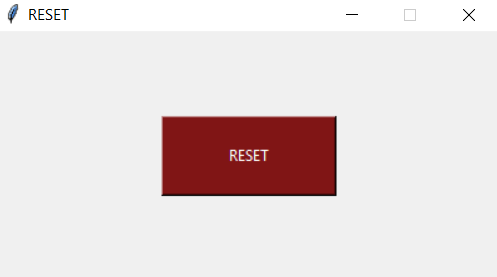
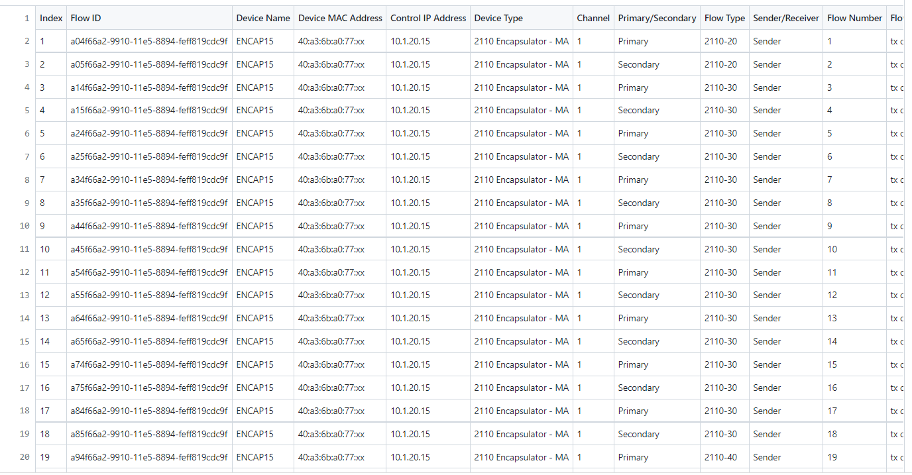
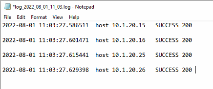
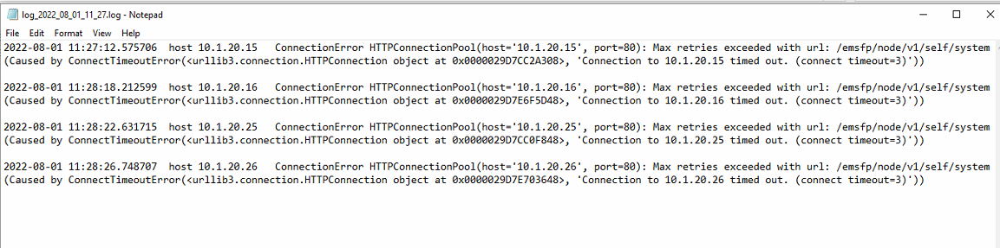

# ST 2110 IP gateway Reset

Python application to reboot multiple ST 2110 SDI-IP gateways with one button click. It uses the IP gateway device REST API to send a reboot request for multiple devices.

ST 2110 is standard for Professional Media over IP infrastructre. It's used in broadcast production and ditribution faciliteis. This IP gateway converts video signals between SDI and ST 2110 IP.

The configuration file exported from the IP gateway management system as csv file `flow_config.csv`. This file include devices IP address, IP multicast flow configuration, MAC address etc...

This Python application processes the csv file `flow_config.csv` and gets a list of device IP adddresses. Then it sends a reboot HTTP request for each device.

It creates a log file in `logs` folder after everytime the button is clicked showing the HTTP request status (Sucess/Error) for every device.
</br>
</br>

To run the application

1. Download and install python. You can find python download website [here](https://www.python.org/downloads/) 
2. Make sure to select "Add Python x.x tp PATH" during the installation.
3. Optional: Create pytohn virtal environment and activate. More information [here](https://docs.python.org/3/tutorial/venv.html)
3. Install python packages form `requirements.txt`

```python
pip install -r requirements.txt 
```

4. Run the following to bundle the Python application and all its dependencies into a single package.

```python
pyinstaller.exe --onefile --icon=warning.ico --windowed  reset-ip-gateway.py
```

pyinstaller will create a folder `build`. In this folder you will fiind the excutable file `.exe`.

</br>
</br>

## Built With

* Python 3.7.9.
* [tkinter](https://docs.python.org/3/library/tkinter.html) to create GUI.
* Python requests library.
* [PyInstaller](https://pyinstaller.org/en/stable/) to bundle the application.

</br>
</br>

## Authors

- **Ali Darraji** - [https://github.com/adarraji](https://github.com/adarraji)

</br>
</br>

## Screenshots

**The application**




**The configuration csv file exported from the ip gateway system and used as input to this application**




**Example of logs file in case of success**




**Example of logs file in case of connection error**




